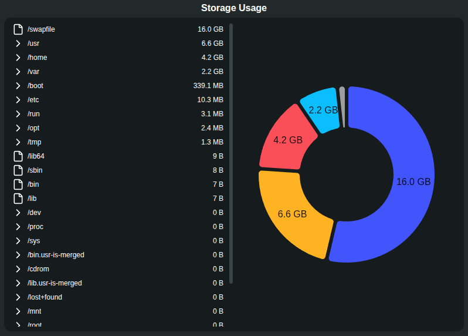

# Rummage

Rummage is a desktop storage utility built with Electron.js and React that helps you understand what's taking up space on your computer.

Rummage scans your filesystem and gives you an easy way to explore directories, identify large files and folders, and find areas where you may be able to free up storage.

## Features

* **Filesystem scanning** — Scan your computer and analyze how storage is being used.
* **Directory overview** — View the files and folders inside your selected root directory.
* **Expandable folders** — Open folders directly in the file list to explore their contents.
* **Storage visualization** — See a donut chart showing how storage is distributed within the selected directory.
* **Directory navigation** — Move through your filesystem and update the storage breakdown as you explore.
* **Find what's taking up space** — Quickly identify large files and folders that may be worth cleaning up.

## How It Works

Rummage scans a directory and collects information about the files and folders inside it.

The application then presents that information in two main ways.

### File Explorer

The file list shows the contents of the current directory. Folders can be expanded to reveal their subfolders and files.

This lets you explore your filesystem from within Rummage and see how storage is being used at different levels.

### Storage Chart

The donut chart provides a visual breakdown of the storage used by items in the currently selected directory.

As you navigate through your folders, the chart updates to show the storage distribution for that location.

## Why Rummage?

Finding what's taking up space can be difficult when your drive contains thousands of files spread across countless folders.

Rummage makes it easier to answer questions like:

* What is taking up the most space?
* Which folders are getting too large?
* Where are my biggest files?
* What can I potentially clean up?
* How is the storage in a particular directory being used?

## Tech Stack

* Node.js
* Electron.js
* React
* TailwindCSS
* JavaScript / TypeScript
* MUI ( Pie chart )
* HTML
* CSS

## Main view



## Development

Clone the repository and install the dependencies:

```bash
git clone <repository-url>
cd rummage
npm install
```

Start Rummage in development mode:

```bash
npm start
```

> Update these commands to match the scripts defined in `package.json`.

## Project Structure

The project structure may change as Rummage develops, but a typical setup looks like:

```text
App/
├── src/
│   ├── components/
│   ├── lib/
│   ├── pages/
│   └── ...
├── main.ts
├── package.json
```

## Safety

Rummage is designed to help you understand your storage usage and decide what may be worth cleaning up.

Be careful when removing files. System files, application data, and other important files may be required for your computer or applications to function properly.

Always verify that a file or folder is safe to remove before deleting it.